# Actividad UF4-Grupal. Base de datos XML FERRETERIA. 
Las clases realizadas se encuentran comentadas paso por paso. 

La tecnología utilizada `Java`, `XML`, `XSD`, `XLS`, `CSS`, `BaseX`, `Xquery`, `JDOM`. 

Grupo por: 
- Juan Antonio Pavón Carmona -> XML Y XLS
- Rubén Beltrán Muñoz -> JDOM
- Miguel Angel Nuñez López -> XSD 
- Cristian Sabal Mauro -> BaseX

Todos los ejercicios lo hemos realizado también de forma individual para así comparar y aprender de los compañeros.

Capturas de resultados:

**Juan Antonio Pavón Carmona -> XML Y XLS**

`xml/recibos.xml` -> validado `XSD`

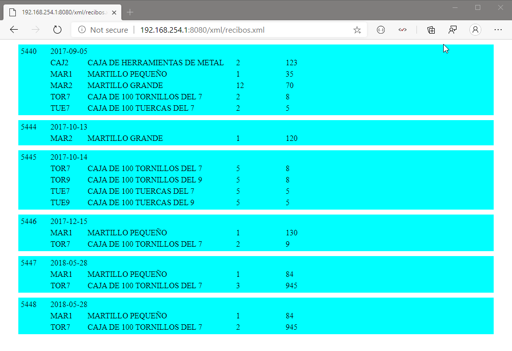

`xml/recibos2.xml`

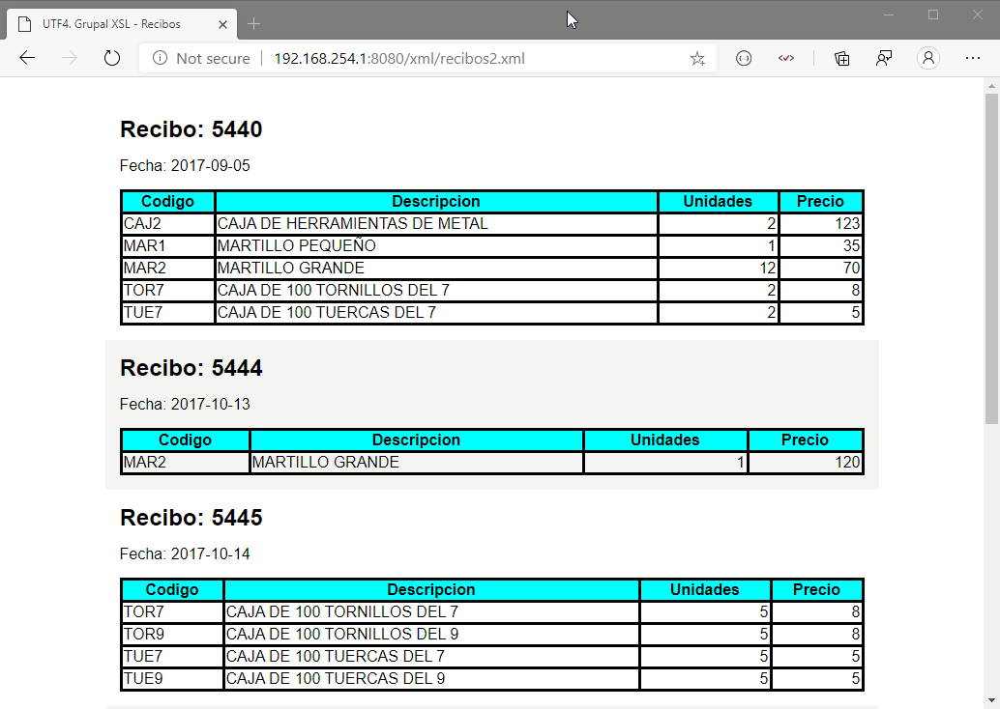

**Rubén Beltrán Muñoz -> DOM** 

`parser DOM`

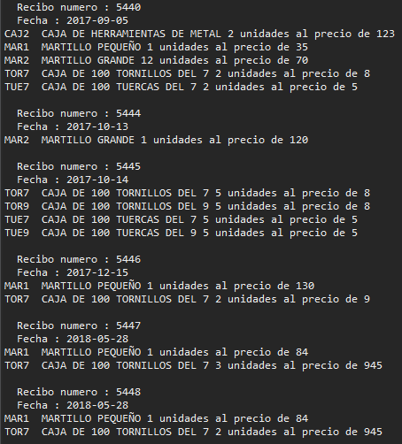

**Miguel Angel Nuñez López-> XSD** 

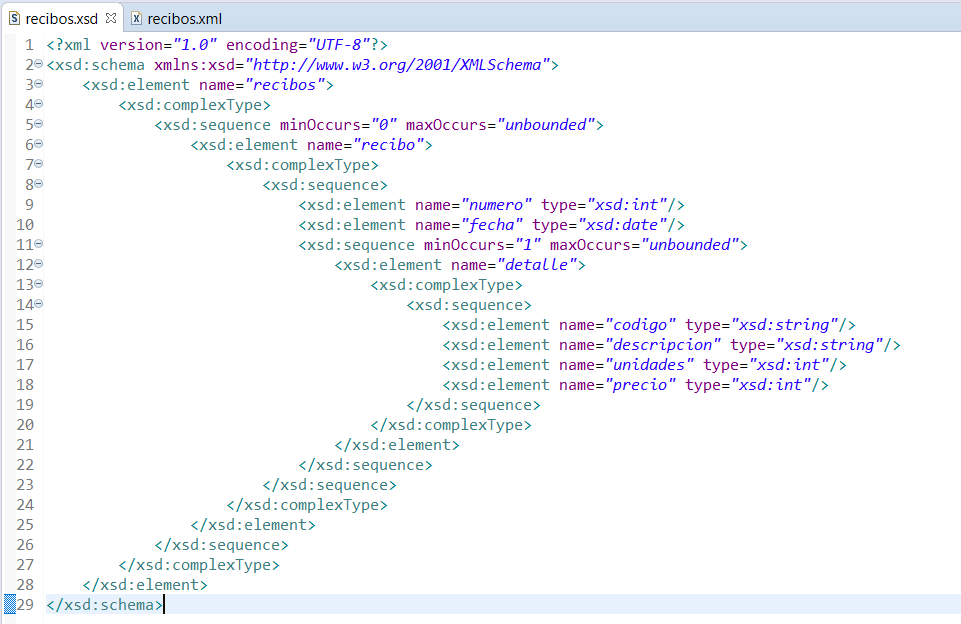

Provocando error para comprobar la validación.
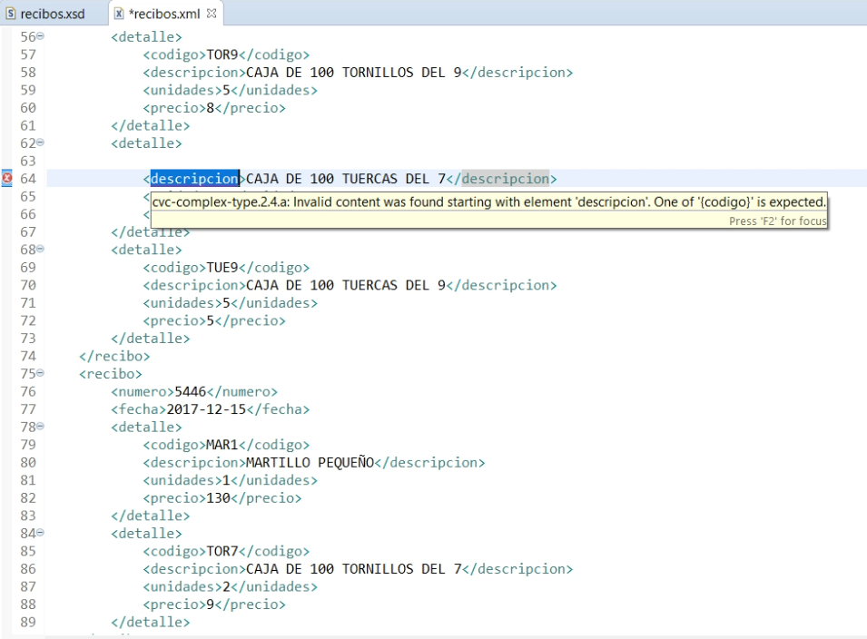

De manera correcta.
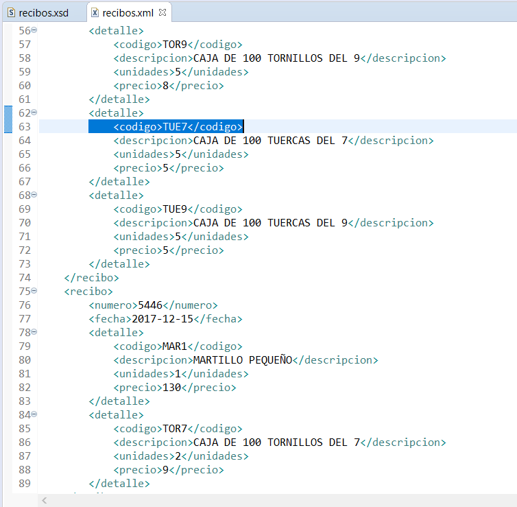

**Cristian Sabal Mauro  -> BaseX** 

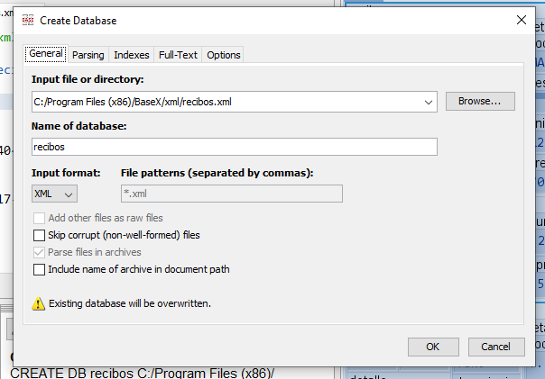

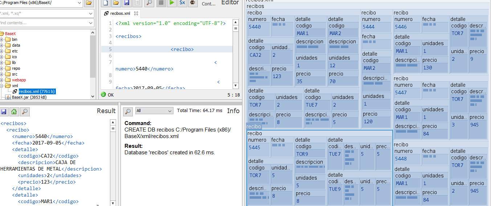

Recibos cuya fecha sea 2017-09-05

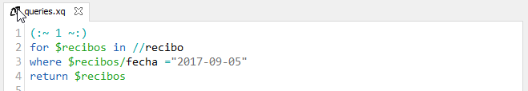
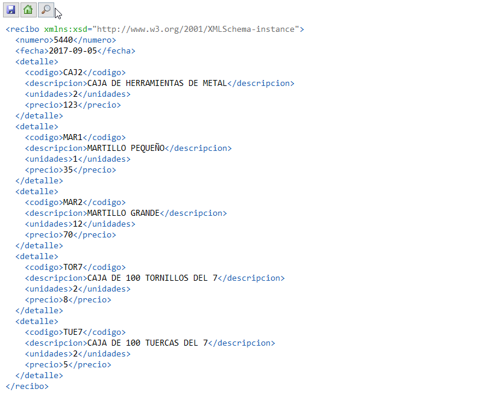

Detalles de ventas del articulo con código “MAR1”

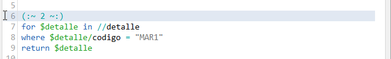
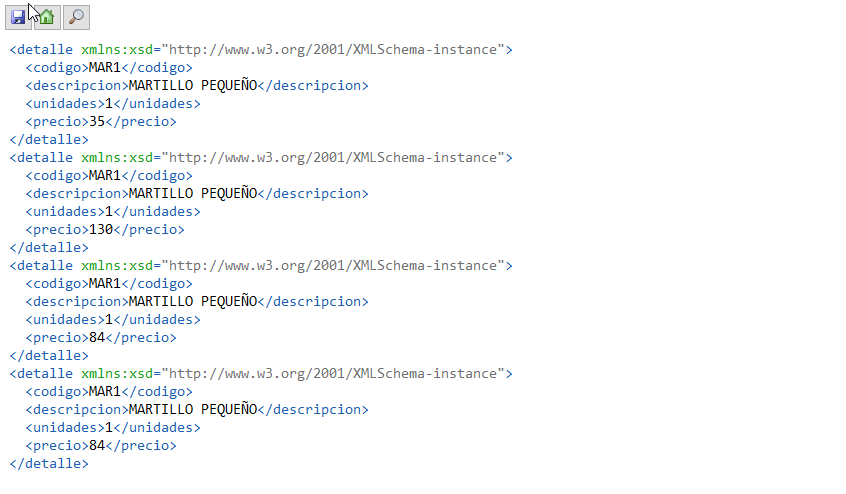

Número total de elementos detalle

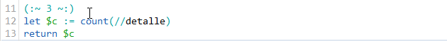

Todos los elementos Detalle ordenados por código

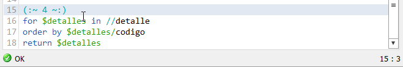
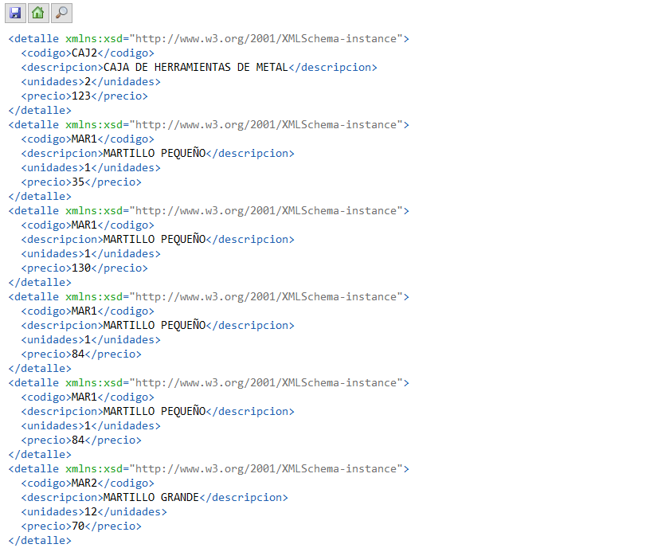
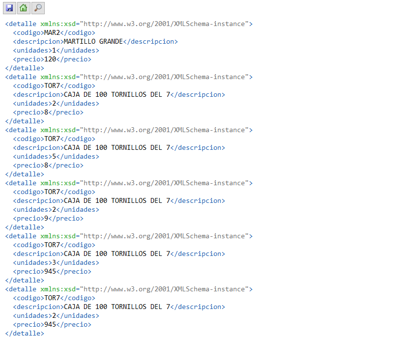
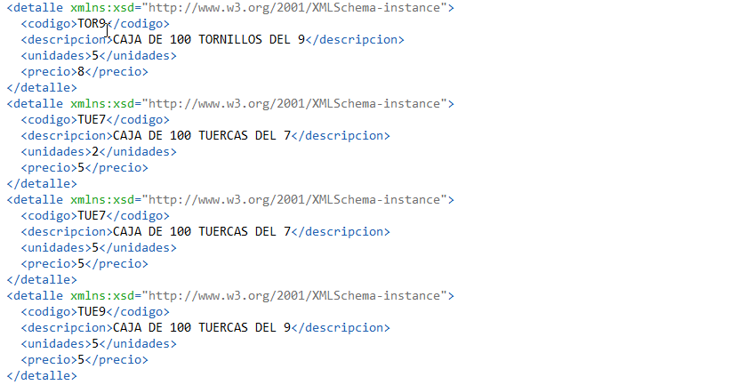

`BaseX & Java`. Listado de detalles de venta ordenadas por el elemento codigo.

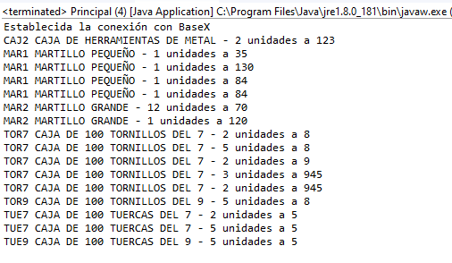

